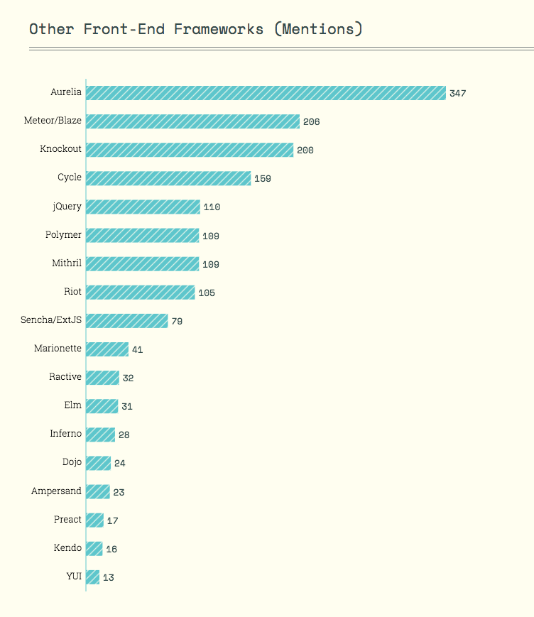

# App Frameworks (Desktop, Mobile, Tablet, etc.) Tools

##### Front-End App Frameworks: [^1]

* [AngularJS](https://angularjs.org/) + [angular-cli](https://github.com/angular/angular-cli) + [Batarang](https://github.com/angular/angularjs-batarang)
* [Aurelia](http://aurelia.io/) + [Aurelia CLI](https://github.com/aurelia/cli)
* [Ember](http://emberjs.com/) + [embercli](https://ember-cli.com/) + [Ember Inspector](https://chrome.google.com/webstore/detail/ember-inspector/bmdblncegkenkacieihfhpjfppoconhi?hl=en)
* [Polymer](https://www.polymer-project.org/1.0/)
* [React](http://facebook.github.io/react/) + [create-react-app](https://github.com/facebookincubator/create-react-app) + [React Developer Tools](https://chrome.google.com/webstore/detail/react-developer-tools/fmkadmapgofadopljbjfkapdkoienihi)
* [Vue.js](http://vuejs.org/) + [vue-cli](https://github.com/vuejs/vue-cli) & [Vue.js devtools](https://chrome.google.com/webstore/detail/vuejs-devtools/nhdogjmejiglipccpnnnanhbledajbpd?hl=en)
* [Riot](http://riotjs.com/)

##### Native Hybrid Mobile WebView (i.e., Browser Engine Driven) Frameworks:

These solutions typically use [Cordova](https://cordova.apache.org/), [crosswalk](https://crosswalk-project.org/), or a custom WebView as a bridge to native APIs.

* [ionic](http://ionicframework.com/)
* [onsen.io](http://onsen.io/)

##### Native Hybrid Mobile Development Webview (i.e., Browser Engine Driven) Environments/Platforms/Tools:

These solutions typically use [Cordova](https://cordova.apache.org/), [crosswalk](https://crosswalk-project.org/), or a custom WebView as a bridge to native APIs.

* [Adobe PhoneGap](http://phonegap.com/) [$]
* [AppBuilder](http://www.telerik.com/appbuilder) [$]
* [cocoon.io](https://cocoon.io) [free to $]
* [ionic hub](http://ionic.io/) [free to $]
* [kony](http://www.kony.com/products/mobility-platform) [$]
* [Monaca](https://monaca.io/) [$]
* [Taco](http://taco.tools/)

##### Native Desktop WebView (i.e., Browser Engine Driven) App Frameworks:

* [Electron](http://electron.atom.io/)
* [NW.js](https://github.com/nwjs/nw.js)

##### Any Platform App Frameworks:

These solutions take your application and build it across several platforms and devices

* [manifoldJS](http://manifoldjs.com/)

##### Native Mobile App Frameworks (Aka JavaScript Native Apps)

These solutions use a JS engine at runtime to interpret JS and bridge that to native APIs. No browser engine or WebView is used. The UI is constructed from native UI components.

* [NativeScript](https://www.nativescript.org/)
* [React Native](https://facebook.github.io/react-native/)
* [tabris.js](https://tabrisjs.com/) [free to $]
* [trigger.io](https://trigger.io/how-it-works/) [$]

##### References:

* [todomvc.com](http://todomvc.com/)
* [Frontend Guidelines Questionnaire](https://github.com/bradfrost/frontend-guidelines-questionnaire)
* [Frontend Guidelines](https://github.com/bendc/frontend-guidelines)

##### Performance:

* [js-framework-benchmark](https://github.com/krausest/js-framework-benchmark)

***

###### NOTES:

Keep an eye on [inferno](https://github.com/trueadm/inferno) and [Svelte](https://svelte.technology/guide) in 2017 for building component based UI applications.

***

###### ADVICE:

[^1] If you are new to front-end/JavaScript application development I'd start with [Riot](http://riotjs.com/) or [Vue.js](http://vuejs.org/). Then I'd work my way to [React](http://facebook.github.io/react/). Then I'd look at [Angular 2](https://angular.io/), [Ember](http://emberjs.com/), or [Aurelia](http://aurelia.io/).

If you are building a simple website that has minimal interactions with data (i.e. mostly a static content web site), you should avoid a front-end framework. A lot of work can be done with a task runner like [Gulp and jQuery](https://github.com/vigetlabs/gulp-starter), while avoiding the unnecessary complexity of learning and use an app framework tool.

Want something smaller than React, consider [Preact](https://preactjs.com/). Preact is an attempt to recreate the core value proposition of React (or similar libraries like Mithril) using as little code as possible, with first-class support for ES2015. Currently the library is around 3kb (minified & gzipped).

Can't decide between React or Angluar 2, read, ["Angular 2 vs React: The Ultimate Dance Off"](https://medium.com/javascript-scene/angular-2-vs-react-the-ultimate-dance-off-60e7dfbc379c#.j0r1xdvzl)

###### SURVEY RESULTS:

The images below are from the [2016 Frontend Tooling Survey](https://ashleynolan.co.uk/blog/frontend-tooling-survey-2016-results) (4715 developers) and [2016 State of JS Survey](http://stateofjs.com/) (9307 developers)

<cite>Image source: <a href="https://ashleynolan.co.uk/blog/frontend-tooling-survey-2016-results">https://ashleynolan.co.uk/blog/frontend-tooling-survey-2016-results</a></cite>

<cite>Image source: <a href="http://stateofjs.com/">http://stateofjs.com/</a></cite>

<cite>Image source: <a href="http://stateofjs.com/">http://stateofjs.com/</a></cite>

